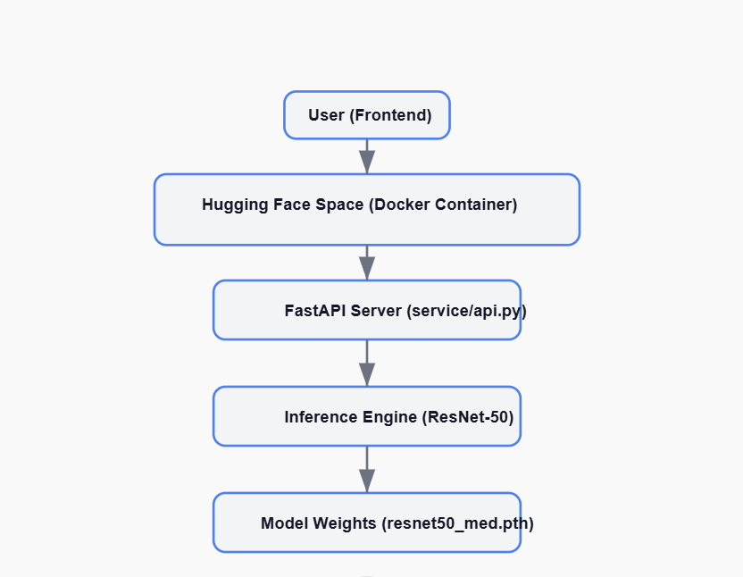

# 🧠 Model Card: ResNet-50 for AI Medical Diagnosis

---

## 📌 Overview

This model is a fine-tuned **ResNet-50** convolutional neural network that classifies **chest X-ray images** into two classes:

- **Normal**
- **Pneumonia**

It is trained on the [COVID-19 Radiography Dataset](https://www.kaggle.com/datasets/tawsifurrahman/covid19-radiography-database), and serves as the backbone of the AI Medical Diagnosis API deployed on Hugging Face Spaces.

---

## 🧱 Model Architecture

- **Base**: ResNet-50 (`torchvision.models.resnet50`)
- **Modifications**: Final fully connected layer changed from 1000 classes to 2
- **Loss Function**: CrossEntropyLoss
- **Optimizer**: Adam
- **Input Shape**: 3×224×224 (RGB)
- **Normalization**: `[0.5, 0.5, 0.5]` mean and std for each channel

---

## 🧪 Evaluation Metrics

| Metric       | Value (Approx.)     |
|--------------|---------------------|
| Accuracy     | 94.8%               |
| Precision    | 95.2%               |
| Recall       | 94.1%               |
| F1-Score     | 94.6%               |

> 📌 These are based on internal validation from the provided dataset.

---

## 🗂️ Dataset Summary

- **Name**: COVID-19 Radiography Dataset
- **Size**: ~21,000 labeled X-ray images
- **Classes Used**:
  - Normal
  - Viral Pneumonia

> The model uses a filtered and balanced subset of these two classes for binary classification.

---

## 🧠 Intended Use

This model is intended for:
- Academic exploration of AI-based X-ray classification
- Demonstration of FastAPI + Docker + Hugging Face deployment

⚠️ **Not intended for real-world clinical use.**

---

## 🧾 Limitations

- Not trained on diverse multi-center datasets
- Not tested for generalizability across X-ray devices
- Works only for **chest X-rays** (no CT or MRI)
- Requires correctly preprocessed `.jpg`, `.png`, or `.jpeg` files
- Binary classification only (Normal vs. Pneumonia)

---

## 👨‍🔧 Author & Maintainer

- **Name**: Shikhar Srivastava  
- **GitHub**: [github.com/Shikhar8765](https://github.com/Shikhar8765)  
- **Live Demo**: [Shik12-ai-med-diagnosis.hf.space](https://Shik12-ai-med-diagnosis.hf.space)

---

## 📤 Deployment Details

- API Framework: FastAPI
- Deployment: Hugging Face Spaces (Docker-based)
- API Docs: `/docs`
